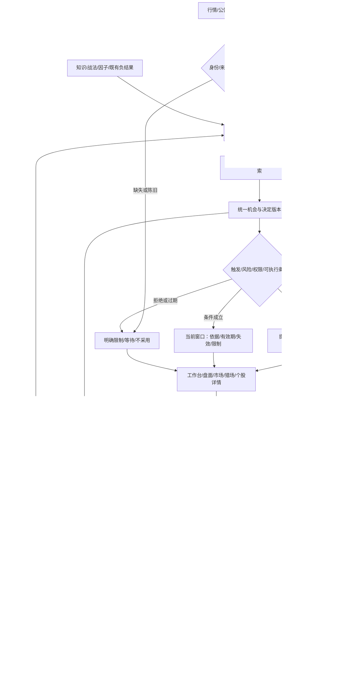
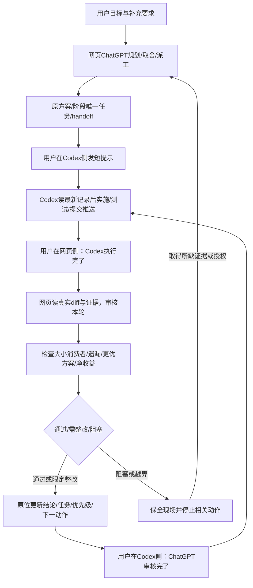

# 产品与全功能闭环设计 v9.3

> 定位：当前产品目标与模块衔接的设计基线，业务行为/导航/UI实施待用户确认；不是已上线报告。上游：[实施方案](implementation-plan.md)、原v9及21条Codex要求；下游：[猎场决策设计](hunting-decision-design.md)、[阶段总账 §6.0](retro-and-gaps.md#60-阶段索引)。任务状态只在阶段页。
> 本轮实际完成：读取主要页面、选股/事件链及KB，隔离复现两个新候选缺陷，补设计和任务，退出旧双端协作自动化。现有业务源码和生产服务未重构，不以设计覆盖证明所有模块已经有效。

## 1. 产品目标与边界

产品不是配置台或“指标越多越好”的排行榜，而是把可靠数据转成少量有条件、有证据、可追溯的观察机会，再用实际结果检验。提前发现、条件触发和可成交分别计量；不能保证提前捕获每次上涨、准确最低点或确定收益。“金健米业”属于待定界案例，不是固定选股白名单。
删除的自动化是网页ChatGPT/Codex相互派工、浏览器自动发送、唤醒、自动审核消费及其原型；保留业务所需的后台采集、计算、缓存、调度、风险监测、复盘和经授权通知。自动计算不得等同于自动晋级策略、自动改生产参数或真实下单。
最新前台要求取代旧“控制台进化默认页、手动推动节拍和参数配置面板”展示要求；保留其合理业务能力到后台，不以隐藏UI代替鉴权。普通界面退出调试告警/预警规则编辑，不隐藏真实风险、失效、不可成交和数据陈旧提示。视觉主题切换、查看证据、关注/取消关注属于使用动作，不是引擎调试。

## 2. 四条用户路径，共用同一机会事实

| 入口 | 用户要解决的问题 | 保留/组合 | 退出普通前台 |
|---|---|---|---|
| 工作台 | 我关注/持有的股票有什么变化 | 自选、个股详情、持仓风险；模拟持仓入口就近呈现 | 重复推荐榜、研究脚本、规则参数 |
| 盘面/市场 | 当前环境、资金主线与事件意味着什么 | 大盘/板块、必要消息/公告，点击串到主题与个股 | 原始采集质量仪表盘、定时任务/接口日志 |
| 猎场 | 现在看谁、为什么、等什么条件 | 统一机会卡、场景标签、时机/风险、共享详情抽屉 | 手动重算组合/简报/单拍、策略权重、调试对照面板 |
| 复盘 | 当时判断对不对、哪里错、接下来改什么 | 观察/触发/模拟结果、漏报/误报/弃权、证据时间线 | 因子调参、模型成本台账、自动进化执行按钮 |

导航保持现有工作台、盘面、市场、猎场四条现有入口，移除交易智能体调试导航，将原有ReviewTab变成用户复盘入口；第一阶段仍最多五项，不能未审场景就强合盘面和市场。保留原密度/字体/边框/zinc色系与亮暗主题，手动持仓数据不删、不新建资产账本。当前没有核到个人中心或社区模块，不为假想功能追加删除计划。
现有/hunting的盘前组合和盘中跟踪语义必须保留；新主界面按行动状态排序，卡片仍带来源/首次观察时间，不将两种样本和收益混算。原/picks、/intraday及?tag/?theme/?sec/?review深链迁移须有对照表；有用链接重定向到真实内容，不整页404，也不把旧调试动作重定向成可执行按钮。

大小功能的逐项检查归 [细功能审计](feature-closure-audit.md)：按钮、字段、日期、筛选、计数、跳转、后台无UI服务均有用途/消费者/失败反馈。四条用户路径只是问题组织，不限制模块、动作或后台情境数量。

## 3. 模块用途—输入—输出—消费者闭包

本表覆盖当前可识别的产品模块族，按输入/消费者决定保留、融合、后移或退出；代码清单不是全量逐行审计。未检验的支路须在GOV-020继续取证，不得宣称全仓没有隐蔽调用。

| 模块族/现有载体 | 处理什么、输出什么 | 下游与终态 | 设计裁定/任务 |
|---|---|---|---|
| 行情、日历、价格规则、身份/复权 | 同一证券及当时有效规则的行情、可用时间、质量 | 图表/场景/模拟执行；缺失显式不可判 | 复用单点规则，历史规则版本化；BUG-020、IMP-040 |
| 指数/板块/情绪/资金 | 市场环境、扩散/集中、相对强度和不确定性 | 场景适用性与风险，不直接宣布股票必涨 | 环境与个股证据分开；IMP-006、RSH-026 |
| 新闻/公告/行业资料 | 事实、修订、传播链与公司业务关联 | 候选假设、反证及事件后验证 | 去重不抹修订，多对多带来源；IMP-048 |
| KB/战法/因子登记 | 规则语义、适用域、版本、验证与否证边界 | 受控特征与解释，未验证项只观察 | 不按“组件已落地”判断有效；RSH-027、IMP-020 |
| 潜伏池/临板雷达/盘前/盘中发现 | 从全市场与既有关注池产生可解释候选 | 统一机会记录，不直接模拟买入 | 修前视与开板转换；BUG-028、BUG-029 |
| 梯队/趋势/波浪/事件路由 | 结合环境、结构和独立证据形成情境假设 | 状态转换、等待条件、反证 | 开放多轴与未知线索，非四类enum；IMP-049 |
| 买点与执行闸门 | 新鲜度、触发、追高边界、权限、流动性和风险 | 条件成立/等待/失效/不可执行 | 共用版本，不从前台拼另一套阈值；IMP-006、IMP-049 |
| 决策/观察快照 | 当时输入、版本、选择和拒绝理由 | 页面、消息、模拟动作及复盘共用ID | 原记录不可被今天重算覆盖；IMP-006 |
| 页面及个股图表 | 用户可理解的证据/位置/条件 | 关注、详情、结果反馈，非引擎控制器 | 保留原风格与真实Canvas；BUG-022、IMP-050 |
| 通知/偏好/Outbox | 状态有意义变化时形成经授权发送意图 | 受理/失败/未知/静默；关联机会而非第二选股器 | 配置在后台；安全提示可见；IMP-044、IMP-032 |
| 模拟执行/持仓/退出 | 以真实可用价与制度约束模拟，区分关注与已有持仓 | 成交/拒绝/持仓风险和结果 | 不连接真实券商，不保证止损必成交；IMP-007 |
| 复盘/标签/机会评分 | 区分机会、标的、时间窗、阶段行与成交收益 | 误报、漏报、弃权与策略检验样本 | 全分母/成熟标签；BUG-026、RSH-026 |
| 实验/研究/影子参数 | 比较基线、反例、成本及样本外效果 | 人工批准的候选变更或否决/退出 | 机器通过≠批准，不自动晋级；IMP-020、IMP-046 |
| 后台智能体/解释器 | 整理证据、发现矛盾、形成可复核建议 | 决策解释和开发建议；失败退化为规则/证据 | 模型不掌握硬门/修改权限；IMP-045、RSH-027 |
| 运营配置/健康/仓库追踪 | 系统维护、预算、权限、文档与故障诊断 | 受控CLI/API和人工工程任务 | 不在交易主前台，删除孤立操作入口；IMP-050 |
| 数据持久化/恢复/测试 | 保证版本、可重跑、失败不覆盖和恢复 | 全链条的可信基线 | 保留必要测试/CI/日志；GOV-013、GOV-021、IMP-043 |
| 开发协作 | 网页规划审核、Codex执行、用户短提示 | 原位更新计划/阶段/交接，下一项经价值复评 | 无Bridge/自动互调依赖；GOV-022 |

## 4. 贯穿全链的身份与停止规则

同一机会在页面、提醒、模拟动作和复盘中共用opportunity_id及decision_version。记录source/available_at、instrument/rule_version、knowledge_version和数据质量；展示价、触发价、拟进入区间、实际模拟成交价各自命名，不能借同一price字段混用。
每个功能必须通过“生产者→消费者→用户决策/内部约束→反馈/退出”的一次正例和一次反例。无消费者的字段不直接新增；无用户用途的页面移出；有保护/恢复作用的低频逻辑不能因低调用删除。缺证据则标未验证，而不是用一个综合分掩盖空值。
重连、重复消息、同秒乱序、午休、休市、数据回补、来源更正、参数撤销和缓存过期均须定义终态。关键数据失效时，不显示仍有效的进入条件；已有持仓风险继续保守呈现，不能整个页面白屏或虚构已卖出。
页面只请求服务端读模型；不能由“打开猎场”触发全市场研究、计费推理、写库复盘或运行Watcher。昂贵分析用已有后台调度/队列，按数据版本幂等；前台可继续展示带来源时间的只读快照。用户离开页面不应停止核心风险监测。

### 4.1 后台化的适用边界

后端拥有选股判定、时机、费用与风险、事件映射、标签、实验、预算、规则和数据保留。前端保留图形坐标、排版、局部筛选与交互、主题/焦点及可重建缓存；用户输入/关注/已读/记账等是业务操作，不当调试删掉。模型管理/任务操作/配置不转移到聊天框形成隐蔽控制台。
后台化必须有受控的既有CLI/API承接和权限测试，不能只删按钮使维护功能失去入口；先迁所有权再清呈现。用户能看必要的时效/风险结果，不能把异常全藏掉。

## 5. 业务闭环与工程闭环

业务链：一手数据/行情→质量与时点校验→环境及场景识别→多假设候选→证据/触发/风险统一决定→猎场与跟踪→授权通知/模拟结果→按时点复盘→受控研究→人工批准的版本更新。缺失、未触发、失效、无法成交和正确弃权都回到复盘，不只记录成功样本。
工程链：用户目标→网页统筹核事实/取舍/派工→阶段唯一任务→Codex实现测试并推送→用户提示完成→网页审核真实diff和证据→价值复评→原位修方案/任务/下一步→用户提示审核完成→Codex读取后继续。不要求自动互调，也不把用户短提示当技术批准。
两链交点是“带证据的改进提议”，不是应用内模型改代码。研究建议只能作为开发/审批输入，不能自主提高仓位、放宽可成交/权限硬门或恢复已封堵的自动转正。

## 6. 逐阶段实施与完成判据（排期归总账 §6.0）

| 顺序 | 当前任务承接 | 可交付结果 | 切换条件 |
|---|---|---|---|
| 0 设计确认与安全清理 | IMP-049、IMP-050、GOV-022 | 确认猎场主视图和模块闭环；删除旧协作原型，保持业务调度 | 本文/猎场设计/流程图被用户确认，清理通过引用与回归 |
| 1 候选真实性 | BUG-028、BUG-029、BUG-026、BUG-020 | 潜伏无前视、开板可达、统计分母可靠，未来数据不改变过去结果 | 正反例＋相同前缀不变测试；不改权重求绿 |
| 2 统一机会契约 | IMP-006、IMP-048、RSH-027 | 机会ID、时点证据、场景、触发/失效和知识版本一致 | 原消费者兼容，重复/修订/缺项与后端读模型通过 |
| 3 猎场和前后台分层 | IMP-049、IMP-050、BUG-022 | 同风格两区主视图与失效记录、证据详情、调试界面退出 | 先固定夹具交互，再真实数据/Canvas；旧深链与权限覆盖 |
| 4 业务反馈闭环 | IMP-044、IMP-007、RSH-026、BUG-009 | 页面—通知—模拟—复盘同一事实，漏报/弃权可追 | 回执未知保留、不可成交不计收益、复盘不回填历史决策 |
| 5 效果与迭代 | IMP-020、RSH-003、GOV-021 | 前瞻盲测、场景对照、成本/尾部风险、受控晋级 | 证据充分才谈策略优势；不等待长样本阻塞工程修复 |

设计、工程、运行和研究效果四层分开销账。UI原型可用固定夹具先做，但不能提前宣称数据链打通；样本不足可保留观察，不为“必须有机会”强行提示。实际数值门槛在任务开工时基于基线冻结，不凭空承诺提升比例。

## 7. 可验证的产品目标与非退化约束

开工前录当前同数据/负载的后端延迟、页面请求数/首屏、CPU内存与数据新鲜度；改善这些指标不能减少覆盖、隐藏过期或放宽安全。卡片从“发现→详情→理解待确认条件”应能连续完成，不跳多个控制页；建议以用户能否迅速回答“为什么在这里、还差什么、什么情况下失效”作验收，具体耗时基线实测后冻结。
视觉验收覆盖亮/暗、1440/1280/768宽度、长中文/空值、键盘焦点、屏幕阅读、减少动效、截图/真实Canvas。价格轴和百分比轴共用参考价；条件线不能与成本线混用。列表更新保留焦点/滚动/展开项，不每拍乱序闪烁；排序只在重要状态改变或稳定窗口切换，时间和排序理由可解释。
后台权限必须实测直接URL和直接API，无权请求不得因为前端隐藏菜单而成功。重试预算、费用与外发权限不改变；CI分钟持续复盘，先本地收敛后一次发布验证，不为测量重复触发云端工作流。

## 8. 总流程图（设计待确认，非已上线）

业务链回答系统怎样服务用户；研究链回答怎样改得更好；工程链回答谁实施、谁审核。小功能核查贯穿三条链，不只审猎场或导航。图中的后台任务是应用功能，不是已废弃的ChatGPT/Codex互调服务。

贯穿所有节点的验收：按钮/输入/筛选/日期/计数/提示/跳转/数据接口/后台任务逐项核用途、身份、时点、失败反馈与恢复。共享记录先提交推送；短提示只触发读取，不代表通过。合并另满足独立审核与准确版本CI，图示箭头不授权真实下单或自动改代码。

## 9. 依据、兼容与未验事项

现状读取基点为26a0c44；主要载体：hunting/page全文及PickCard接口/主要呈现、agent/page、nav-bar、globals.css，picks潜伏/雷达/观察/执行链、事件接口与KB-STOCK相关正文。读到代码不等于生产已加载。运行数据、用户指定金健历史区间、所有后端支路逐行和全部屏幕目视未在本轮验收；既有GOV-020/GOV-021继续承接，不冒充全仓终审。
研究方法参考：Feast点时关联只用于“当时可用”的数据原则，另保留接收/修订时间；scikit-learn数据泄漏说明用于训练/测试隔离，不引入额外Feature Store或新模型框架。出处：https://docs.feast.dev/getting-started/concepts/point-in-time-joins ；https://scikit-learn.org/stable/common_pitfalls.html 。
规则有效性须按证券/板块/日期读取单点规则及正式通知；上交所2026-04-24发布说明指出修订于2026-07-06实施，当前price_rules已按现行比例处理主板风险警示股票，但历史查询必须额外按当时日期/证券状态处理，不能倒用现行比例。出处：https://star.sse.com.cn/aboutus/mediacenter/hotandd/c/c_20260424_10816474.shtml 。本方案不重新规定费率、限价或证券权限。
用户最新展示要求取代历史UI位置而非抹除历史需求：原盘前/盘中来源、主板权限、风险提示、通知选择、真实图表、可恢复和持续节省均保留。新发现必须带证据/影响/收益/替代/验收/恢复才能加任务；不得借“前瞻性”扩成通用自治平台。
