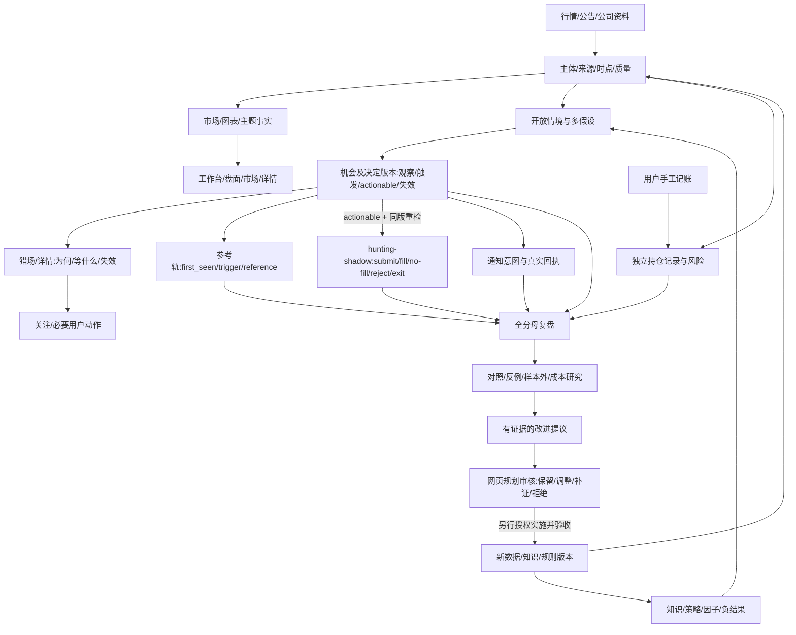
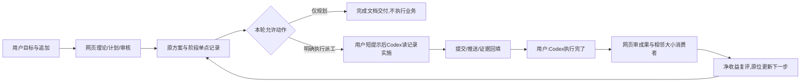

# 产品与全功能闭环设计 v9.13

**现行批准：U52–U55（2026-09-26，用户确认v1.3）**。旧导航、模块数量、风格和锁屏约定不再是硬限制；本文件定义获准比较方案，状态归stage。确认记录见 [批准记录](../review/system-plan-v13-approval-20260926.md)。获批规划不等于B/C已实测胜出或整站施工已授权。

> 当前理论设计的定稿说明，不是实现或运行验收报告。上游：[实施方案](../implementation-plan.md)；选股细则：[猎场设计](hunting-decision-design.md)；现有入口、小动作和历史疑点：[细功能覆盖](feature-closure-audit.md)。状态只归 [阶段账本](../retro-and-gaps.md#60-阶段索引)。
> 本版补齐全产品对象、大小功能目标行为、前后台分工、反馈与研究边界；不执行业务任务，也不以源码盘点数量宣称全仓已深审。当前知识与历史冲突裁定见 [计划去向](../plan-registry.md)。

## 1. 目标：有用、清楚、可追溯，而非功能堆叠

用户能从真实信息理解市场、发现有条件的机会、跟踪关注/持仓、管理模拟或手工记录、核对判断结果。每个模块的输出须被真实用户路径或内部保护/验证消费；纯装饰不伪装成分析能力，低频安全功能不因低点击删除。
早期发现、条件成立、具备执行条件和实际模拟成交分别记录；不存在保证起爆前抓全、准确最低点或必赚。金健米业等是研究示例，不是白名单或事后调参目标。未知情境可留事实，不用“其他”掩盖硬猜。
所有功能不必都产生选股机会：市场/图表帮助认知，记账维护用户事实，通知负责有价值变化，复盘检验判断，权限/备份保护系统。共享身份与证据，不把不同价值强塞进同一机会记录。
保留模块化单体及既有数据/服务/组件；新对象是逻辑契约，不要求逐个新建表、服务、队列或Agent。先查现有载体并做最小映射，再决定是否需要新字段或边界。

## 2. 任务型导航、大模块与前后台位置

### 2.1 四种边界与竞争方案

导航回答用户到哪里完成任务；业务能力拥有定义/计算/状态/责任；组件视图呈现事实；W/G/P账本拥有归属/门序/优先级。四者分别评估，菜单合并不要求合数据库/账户/运行循环，也不自动调整阶段。名称、数量、增删、合并拆分与风格都可依据证据重议；一个事实owner允许多个只读入口。

| 候选 | 主入口组织 | 价值与代价 | 裁定 |
|---|---|---|---|
| A 现状澄清 | 工作台、盘面、市场、猎场、交易智能体 | 熟悉/迁移少；研究阅读与维护混合、跨页恢复待改善 | 保留同任务基线 |
| B 五任务主页 | 市场全景、机会发现、自选跟踪、持仓与模拟、复盘研究 | 环境浏览融合、观察/账务分开；一级拆分是否值得仍未测 | 首选比较候选，不直接切换 |
| C 四任务主页 | 市场全景、机会发现、我的跟踪、复盘研究 | 个人对象集中；我的跟踪内必须明确自选/持仓/模拟模式 | 必须与B比较，尤其窄屏 |
| D 六任务主页 | B另设事件与公告 | 重度事件研究可能受益；普通任务入口增多 | 有独立高频任务证据才升级 |

五个不是永久上限，原M01–M18仅审计域。JEV总体偏好B但N03对自选/持仓拆一级为insufficient，必须保留分歧；不得传播为模型一致赞成。首页可记住用户明确选择，不另造重复总览榜。

### 2.2 B候选的五个模块定义

| 定位 | 任务与子功能 | 主要输入/下游 | 不承担/减少 |
|---|---|---|---|
| H01 市场全景 | 指数/广度/成交额、题材/行业/梯队、涨跌停/断板、龙虎榜、资金、云图、事件公告/修订；低频宏观按需 | 可信市场/披露事实→对象下钻/机会关联→返回原筛选 | 合产品入口而非统计口径，不拥有订单，不拼一排全部旧Tab |
| H02 机会发现 | 盘前/盘中、早期/未知线索、等待/触发/失效、成因反证、版本、参考跟踪、未选/未提醒原因 | 后台已准入召回/决定→参考、授权通知/影子→H05结果 | 开放情境不做固定菜单；完整订单归H04、跨日研究归H05；不强加自选 |
| H03 自选跟踪 | 加/取消关注、排序/有限分组、最近对象、连续看股、事件/风险变化、今日条件计划摘要；已保存视图按需验证 | 用户事实→变化→复核/取消；H05同版计划只读投影 | 不复制推荐榜，不为每股强制生成模型报告；取消关注不平仓 |
| H04 持仓与模拟 | 手工记录/修订、手工模拟、每日精选shadow、hunting-shadow、预检/订单/撤单/费用/拒绝/未成交/退出/恢复 | 明确scope的记录或actual fill→风险→退出/对账→H05 | 统一入口不合账户；手工非券商验证；不合本金/收益率；不接实盘 |
| H05 复盘研究 | 冻结报告、判断/结果、参考/成交、漏报误报弃权/未成交、失败案例、已有研究证据、KB使用、JEV贡献、次日计划 | 成熟结果→反例/实验→证据/原准入→新版本观察 | 阅读不重算；昂贵实验/标注管理/调参批准/回滚进受控区域 |

搜索、对象详情、证据侧栏、消息、助手与个人偏好是共享能力。旧“猎场”保留检索别名；feature ID、API和事实身份不随中文名称变化。独立事件、研究工作室、风险工作区目前WATCH，只有持续独立任务/owner/价值/恢复证明子视图不够时才新增。

### 2.3 系统维护与后台接管

系统维护保留可发现、受授权保护的入口，承接数据/调度、任务与预算、受控研究、参数批准、模型/依赖、取消/重试、备份/恢复和诊断。普通用户就地看到源时间、失败、模拟暂停或报告未生成；不能隐藏故障来制造健康。
四类执行位置分开：后台自动生产；后端响应用户命令；受控维护命令；前端表现。保存自选/记账/提交模拟/撤单仍是正常用户操作；布局/焦点/动画/图坐标/草稿不机械上服务器，私人聊天不默默上传。
迁出生成/重算/单拍/调参/重置按钮前，原owner必须验证：触发条件、输入版本、幂等/单写者、持久结果、消费者、可读失败/重试/取消、预算、重启恢复、鉴权与维护兜底。关闭所有页面后已批准业务仍推进；再次打开GET不扩研究分母、不计费、不外发、不重提交。机器关机不保证后台持续运行，30条声明不等30项运行通过。

### 2.4 联动布局与视觉比较

以证据优先联动研究台为首选布局：稳定导航→对象/时间条→主任务区→按需证据侧栏。对照原多页方案，自由停靠仅在明确高阶用途时实验，不预建低代码页面或万能插件平台。
follow跟随/pin固定/compare对比必须显式；上下文按需要携带对象类型/ID、时间窗、decision/event版本、账户scope、来源与返回锚点。URL不是授权；跨页切股不能修改未提交草稿。桌面内部滚动清楚分区；手机/较大缩放允许顺序自然滚动，不能为锁屏裁掉内容。大图可扩主画布，关闭恢复焦点/选择/位置而非旧行情。
旧zinc/字号/圆角/密度仅作A视觉基线；B可比较石墨/纸白研究终端方向，操作紧凑、证据阅读从容。涨跌、危险、警告、未知的语义与对比度保留但不冻结色号；设计从G2前置，不等G4才补美观。
流程即时反馈与事实生效分开：实时刷新不移动正在点击的行；写入pending不假成功；动画可反向/取消，退出层不留遮罩。CSS与JS都支持减弱动效，键盘、风险和输入不等待动画。原120/160/200/280ms只是基线；具体效果用目标设备与同任务验证。

### 2.5 验收与模块退出

同内容A/B/C测试市场变化、题材成员、公告更正、机会条件、未选/未提醒、自选、持仓风险、记录/模拟区分、未成交、历史判断、次日计划和维护返回等12类任务。记录首击错误、完成、耗时、往返、身份误解、风险遗漏、可访问性与主观负担；小样本不宣称总体极佳。C更简单且不退化则采用C；融合妨碍盘面任务则恢复独立入口。
减少菜单、按钮、重复呈现、运行机制和持久数据是不同决定。旧完整详情/订单/报告装配只有相同语义、消费者迁完、保留义务与恢复通过后才退出；低频保护不因点击少删除。迁移采用准确契约→兼容读/只读对照→单路径切换→验收→旧装配退出，不双写通知/订单。

## 3. 数据对象、所有权与关联契约

| 逻辑对象 | 拥有者与写入触发 | 关键身份/时点 | 消费与反馈 |
|---|---|---|---|
| MarketContext | 现有行情/环境服务，合格数据到达 | instrument/board、source_asof、available_at、quality、rule_version | 图表/市场/候选/风险；失败与修订回到数据质量 |
| EventRevision | 现有事件服务，原文发布/修订/撤回 | event_id、revision、来源谱系、published/received、公司业务映射 | 市场/详情/机会假设；事后解释不倒填催化 |
| Hypothesis/Opportunity | 已准入召回规则及受控研究线索 | symbol、机会轮次、scenario_ids、first_seen、证据/反证/适用域 | 猎场和研究；多假设可共存，不重复放大样本 |
| DecisionSnapshot | 现有决定/观察载体，规则计算完成 | decision_id/version、输入/知识/规则版本、等待/触发/失效、expires_at | UI/通知/模拟各自读取；新证据追加版本不覆写旧事实 |
| NotificationIntent/Receipt | 通知服务，符合用户授权的有意义变化 | intent_id、decision或risk/event引用、渠道、去重键、送达状态 | 铃铛/授权外发；未发/已受理/送达/失败/未知各自记录 |
| PaperAction/Position | 模拟服务，actionable decision 动作前重检后提交 | action_id、decision/version、scope、报价/规则版本、submit/fill/reject/no_fill/订单/成交/费用 | 用户手工 paper、daily-picks shadow、hunting-shadow scope 分离；reference 出现不代表已成交 |
| ManualTradeRecord | 用户明确记账，持久服务维护修订 | record_id、证券/交易日、数量/价/费、revision | 用户持仓/盈亏；不伪装成券商连接或模拟成交 |
| ReviewObservation | 复盘服务，在标签成熟或更正时产生 | 被评对象/决定版本、horizon、label/cost版本、分母身份 | 用户复盘/研究；曝光、点击和获利不是同一标签 |
| Experiment/ChangeProposal | 研究提出、工程/批准方裁决 | 假设、适用域、基线/候选、数据/指标/预算/停止条件 | 对照/否证/批准记录；不是应用内自动改码 |

证券/日期/来源身份是共同基础。只有源于同一次选股决定的页面、通知、模拟和复盘才共用decision引用；市场指数和手工记录可独立存在，再通过明确关联连接。不得为了统一而伪造不适用字段。
读路径仅呈现已有业务事实，可维护缓存和访问日志；打开页面不得生成研究样本、执行选股、发通知或计费模型。命令路径需要权限、对象版本、幂等/并发语义及回执；先持久提交再提示成功。现有后台拥有采集与计算，用户关闭页面不停止风险服务。
发生时间、可知时间、接收次序和实例耗时分开；迟到/修订可以改变当前判断，但保留过去当时版本。历史规则/复权/成分/财报修订按当时有效状态，不用今日资料补出“当时就知道”。

## 4. 全模块用途和闭环

| 模块族 | 输入→处理→输出 | 终态与规划承接 |
|---|---|---|
| 数据源/日历/身份/规则 | 原始信息→单位/日期/主体/许可校验→可信事实 | 成功/合法空/陈旧/失败区分；BUG-020、IMP-040 |
| Hub/缓存/WS/快照 | 同源事实→有序分发/缓存/原子快照→多消费者 | 重连/乱序/过期不冒充最新；IMP-019、GOV-013 |
| 市场/资金/情绪/梯队 | 广度/价格/题材/资金→分层环境→可解释市场背景 | 热度不等赚钱效应、缺榜不等0；IMP-006/049 |
| 新闻/公告/知识 | 原文/案例/研究→抽取/修订/适用性→事实与候选解释 | 原文可追、未知不硬归因；IMP-048、RSH-027 |
| 候选/选股/时机 | 多入口与适用方法→开放情境→等待/触发/反证 | 无机会合法、硬门不被分数冲掉；BUG-028/029、IMP-049 |
| 图表/自选/详情 | 同对象事实与用户偏好→清晰表达和正常操作 | 基准/日期/交互/失败反馈可核；BUG-022、IMP-050 |
| 通知/偏好 | 有用状态变化→授权/排队/重检→意图与真实结果 | 静默有原因、未知不重发假成功；IMP-044/032、BUG-016 |
| 模拟/风控/退出 | actionable decision 与有效报价→同版重检/撮合→订单持仓事实 | reference 轨不冒充成交；hunting-shadow 与手工/每日精选 scope 分离；T+1/费用/权限不削弱；IMP-053/007 |
| 手工持仓/记录 | 用户输入→校验/修订→独立用户事实 | 可撤销/恢复、日期不串、无价不当零收益；GOV-013 |
| 复盘/标签 | 冻结决定与成熟结果→分母/归因→可核解释 | 失败/漏报/弃权/未成交都保留；BUG-009/026、RSH-026 |
| 研究/因子/策略 | 假设与版本输入→对照/反例→适用性证据 | 未测/观察/否决/准入不混；RSH-003、IMP-020 |
| 智能体/助手 | 获准事实/知识→整理/检索/竞争解释→答案或提议 | 解释缺失可退化、代码只提议；IMP-051/046 |
| 后台运营/保护 | 配置/健康/预算/权限→受控维护→可观察可靠性 | 配置与管理入口后移，安全API仍受控；IMP-050、GOV-012 |
| 存储/迁移/恢复 | 持久事实/版本→一致备份/对账→可恢复状态 | 已外发副作用另核；GOV-013/018 |
| 开发治理 | 需求/证据→网页规划/审核→阶段记录与限定派工 | 用户短提示转接；不建互调平台；GOV-020/022 |

## 5. 小功能的目标行为（设计已明确，运行验证以后实施）

细功能审计保留已读来源、疑点和任务去向；本表补“应当怎样工作”。一个动作属于多行时同时满足，不用只测父组件代替。未列出的新小动作按§5.1契约登记，而非被默认忽略。

| 动作组 | 目标行为/交互 | 错误、恢复与未来验收 |
|---|---|---|
| 搜索输入/防抖/中文输入/回车/关闭 | 以完成输入及当前查询结果行动，键盘与点击同义；结果区分证券/主题/文本 | 旧结果和未完成IME不得提交；错误可见；查询快速切换/清空/卸载场景 |
| 加/删自选、拖排、切股 | 服务端确认长期事实，临时乐观态标pending；同步同一用户列表 | 失败恢复原态，重复点击幂等；冲突不静默覆盖；未知对象不创建伪证券 |
| 日期/周期/种类/筛选/排序/分页 | 结果键含实际参数；标题、计数、正文与深链共用身份 | 成功和失败均只作用当前请求；空结果也保留查询日期；不同时间口径不得混算 |
| 图表/轴/参考线/回放/tooltip | 价格/百分比同基准，成本与条件线分开；回放不看未来，播放/暂停/退出一致 | 字段缺失不补假刻度；真实Canvas、拖动/缩放/切日/复权与长文本验收 |
| 详情/Drawer/Modal/Popover/外链/返回 | 同证券/事件对象持续浏览，保留必要来源上下文、焦点与内部滚动；按上下文/阻断性/空间需求选 overlay | 合法实体才生成链接；六位数字不天然是股票；关闭/返回恢复焦点并取消无意义更新，旧URL明确落点；不把巨型 Modal 或 Drawer 当唯一模板 |
| 资金/云图/题材/龙虎榜下钻 | 主视图和详情使用相同板块/日期；真实聚合、估算与代理清楚区分 | 旧响应不串板块；缺席位不当0；自选变动同步；hover/键盘/小格均可用 |
| 猎场卡片/机会详情/关注 | 为何、当前状态、还缺什么、失效/限制优先；同股多假设一主呈现；reference/actionable/shadow 状态清楚 | 无有效区间不回退伪买点；封死/未知不可交易；观察/reference 不能算实际入场；开盘状态不冻结全天，后续新事实另版重评 |
| 通知铃铛/单条/全部已读/清除 | 业务内容、未读水位和清除视图分开持久；用户能知道行动是否成功 | 多窗合并与恢复不复活已清内容；清除不是删除审计；不能声称清本地缓存即恢复服务器状态 |
| 通知筛选/分页/行情/判读入口 | 资讯浏览与机会未读分开，数量与当前范围同分母；打开同事件/决定详情 | 无数据、失败、未判读分别显示；不让分页或重试重复计数 |
| 模拟价格/数量/预检/提交/撤单 | 手工模拟输入有版本、后端同版费用/风险，现价填入是明确动作；猎场自动 shadow 只消费 actionable decision/version；预检与提交分开 | 行情不覆盖正在编辑值；提交前重检；自动 shadow 幂等且独立 scope；取消/拒单/no-fill/成交未知可核，调试重置迁后台 |
| 手工记账/费/日期/修正/删除 | 交易日按明确市场口径；记录与修订可追，原始事实不被展示修正抹去 | 非法量/价/费有反馈；切股不带旧草稿；不把录入等同真实下单；恢复后对账 |
| 助手发送/停止/重试/历史 | 有限权限检索与解释，完成/失败/中断分开；私有历史缓存与后台决策事实不同 | 停止不假成功，重试不重复业务副作用；存储不足明确降级；不默默上传聊天或扩大工具权限 |
| 复盘展开/切日/阅读/反馈 | 冻结报告版本和对象，实际结果对照当时判断；提供只读用户反馈路径 | 初始化/点击/刷新/关闭都绑定当前请求；失败不能永久加载；采纳率不是效果，处置按钮后移 |
| 主题/宽度/焦点/键盘/可见性 | 只保留提高可用性的偏好；统一组件，隐藏标签页暂停无意义请求 | 本地存储失败不拖垮业务；小屏/屏幕阅读/减少动效/恢复焦点；纯表现计算无需后端往返 |
| 后台29注册与每个API | 一项明确拥有者、开关、输入、输出、消费者、预算、失败与取消/恢复 | 按实际挂载鉴权；未知不标完成；GET无业务命令副作用；文件数/路由数只是覆盖分母 |

### 5.1 所有动作共用的最小契约

每个动作标明：actor/权限、对象ID与版本、输入字段/单位/日期、前置、读或写、幂等键或冲突条件、结果/错误、取消边界、持久载体、下游、隐私/保留及恢复。作为原任务验收字段，不新建一套Action平台。
读取状态区分尚未请求、加载、有效结果、合法空、陈旧缓存与错误；陈旧缓存可展示但禁用依赖新鲜数据的动作。写操作区分待提交、受理、完成、失败、结果未知；前端收到请求受理不等于后端业务完成。每次覆盖同时检查对象和请求代次。
后端业务校验为权威，前端可作即时输入提示但不维护第二套金融算法。长期自选/已读/记录在后端；UI布局和可重建草稿可本地。私人聊天是否同步另按最少必要和明确用途决定，不以“全部后台化”自动上传。

## 6. 研究、知识与改进如何真正形成闭环

知识条目分规则/案例/假设/反证；方法分因子/过滤器/排序器/完整策略，开放情境只是适用描述，不是重新注册一堆策略。已实现不等有效，负结果不因换标签复活；缺原始定义只保留候选，具体来源处置见计划去向§4。
观察同时保留未推荐、未触发、拒绝、未成交与漏报；实际行情不是模型自评。形成建议后先核原因/竞争解释、相邻大小消费者、低成本替代及收益风险，再决定并入任务/补证/重排/否决。每天没有值得改的内容是合法结论。
实验固定数据/规则/候选/标签/费用与预算，区分样本内、样本外、前向；避免未来信息、存活偏差、重复样本和事后分桶。硬安全不以平均收益是否显著决定保留；商业效用不以采纳率或任务数量证明。
批准的工程变更经实现、独立审核和原发布条件进入新版本；应用内模型不落地代码、不自产批准、不因温和变化自动转正。现有有界采集、记录、影子和安全恢复可后台运行，新的执行权限不能由理论方案自动授予。

## 7. 非退化、迁移与完成判据

实现阶段先测同输入/同覆盖/同新鲜度的延迟、错误率、尾延迟、CPU/内存、请求/模型/CI成本，再冻结不退化线。改善不能来自删候选、隐藏陈旧、降低风险约束或排除失败样本；具体数字在基线可得时确定，不在规划凭空保证提升比例。
替换采用契约先行→旧消费者适配→只读对照→单路径切换→确认无消费者再退出。读模型错误可退回仍可信版本；数据/规则版本、通知外部副作用、用户记录各自恢复，不能只git回退宣称世界回到过去。
设计验收：全部模块及小动作有用途与契约，主要反例和验证方法可执行，来源与未知分清。工程、真实运行、研究有效性、用户价值是之后四类独立证据；本次只完成设计，不以3851项旧测试或结构盘点充作当前验收。

## 8. 完整关系图（设计，不代表已经运行）

这些图不授权自动转递、真实券商交易或应用内自动改码。每个小动作通过自己的对象关系接入，不要求都绕选股一圈；缺数/拒绝/不操作也有真实反馈。

## 9. 依据和版本

继承29eae6f版本的三专题/阶段证据、39需求、37KB用途和29后台注册映射。原函数反例、静态疑点及未验事实仍在细功能审计和相应任务，本文补的是目标设计，不宣称进一步运行它们。
U40 只限定 2026-09-18 历史规划批为理论/计划/文档收口；后续开发、数据核验、策略研究、真实 UI/通知和发布仍按另外明确的派工执行。U47 在此基础上补充 reference/actionable/fill 双轨、盘中动态 decision version、hunting-shadow 独立 scope、猎场工作流分区、overlay/内部滚动与后置动效治理；这些仍是目标设计，不冒充已实施或已验证收益。本版与计划去向共同裁定旧资料冲突，历史原文不删除；已有流程图可作为解释副本，文字矛盾时以本版图和对象契约为准。

## 10. 全域组件与JEV凭证契约（U53/U54）

| 组件族 | 目标及非退化判据 |
|---|---|
| C01 导航/外壳 | 语义任务、稳定顺序、别名与窄屏可达，框架不随外壳强换 |
| C02 对象/时间联动 | follow/pin/compare明确；对象、时间、version、scope与草稿分离 |
| C03 异步资源 | idle/loading/ready/empty/stale/error；请求代次与源时点；局部失败不当零 |
| C04 Overlay | 初始焦点、顶层Esc、圈定/恢复、背景隔离、嵌套、退出/反向；按空间选形态 |
| C05 搜索/筛选 | 中文IME、实体、键盘、迟到响应、失败反馈；不假加自选成功 |
| C06 表格/列表 | 稳定key、排序/列/密度、焦点锚点；实测需要才虚拟化 |
| C07 机会卡/条件 | 身份、来源、状态、等待/失效、reference/actionable/fill分名，不造总胜率 |
| C08 证据/时间线 | 同版原文、修订、决定与结果；缺节点显式unknown |
| C09 JEV凭证 | 是否参与→问题/依据→结构化判断→实际采纳→后续结果；研发共审不填业务贡献 |
| C10 图表 | 保留已验Canvas语义，价格/百分比/成本/成交/复权分清，空间足够 |
| C11 表单 | 后端同版费用/风险、pending/unknown、幂等与草稿恢复；现价不冲掉输入 |
| C12 消息/反馈 | 读取水位不等送达，清除不删审计；风险与外发unknown可见 |
| C13 分屏/布局 | 按任务展开/固定，窄屏/放大可读，不预造自由桌面 |
| C14 动效 | 状态/空间/反馈有目的，可中断，CSS/JS减弱策略，不代替性能测量 |
| C15 富文本/引用 | 原文/外链安全、来源版本、实体核查，不以六位数字直接当证券 |
| C16 受控维护 | 命令/预算/取消/批准/实际加载身份，直接URL/API仍鉴权 |

每族先比较现状、最小修补、已有依赖扩展、外部候选与不换。许可/安全/兼容/权限为硬条件，不能由审美或模型分数抵消；Jev只读获准最小证据，预算未知/结果不足回人工原流程。实例、键盘/焦点、Canvas、主题/缩放、CPU/内存/帧耗时、迁移与维护成本须真实同条件验证；不自动安装任何新库。
JEV业务主摘要只说与当前任务有关的已发生影响；展开给问题/来源/版本/反证/判断/采用状态与结果，维护层才显示版本/用量/错误。后加解释标事后归纳，不伪当时理由，不展示隐藏思维链；confidence不是可靠率或上涨概率。无模型参与/失败/未采纳/结果未成熟各有真状态。
六闭环分别验：市场认知；机会与行动；个人关注；记录与风险；研究与知识；运行与治理。互相能跳转只证明导航，不证明输入→owner→持久结果→消费→失败恢复→效果反馈闭合。子功能与源码归属详见细功能文档，状态只归各原stage。
